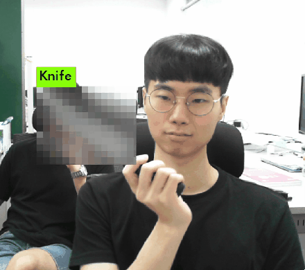
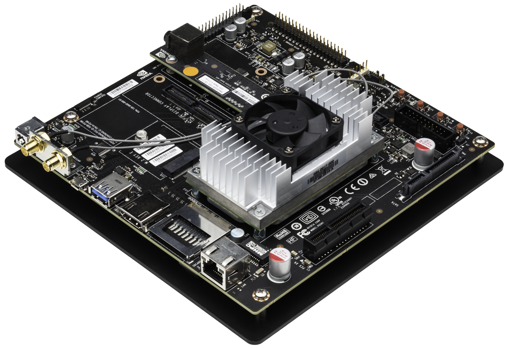
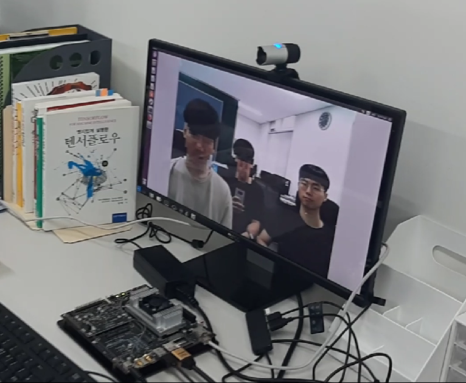
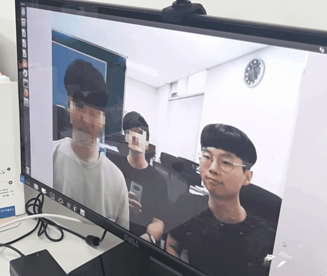
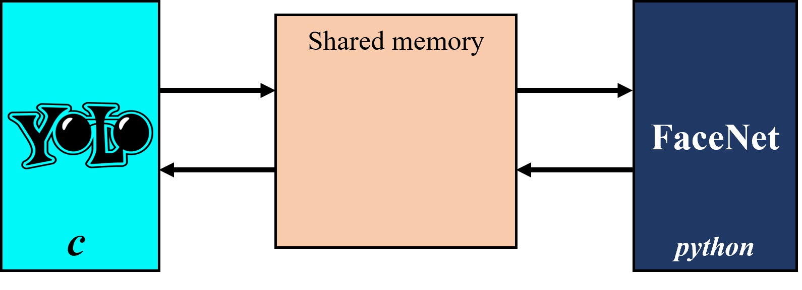

# 실시간 특정 객체 모자이크 시스템
   

#### 설명

우리나라는 초상권 보호와 방송법 준수를 위해 얼굴 또는 유해 매체에 모자이크 처리를 수행합니다.    
딥러닝 모델을 사용해 이러한 이미지 처리를 실시간으로 처리하여 기존 방송 뿐만 아니라 실시간 방송에서 적용이 가능합니다.    

#### 정리

실시간으로 특정 객체에 이미지 처리를 수행하는 시스템 입니다.   
촬영 후 편집으로 수행했던 작업들을 실시간으로 처리할 수 있으므로 실시간 미디어 매체에 활용이 가능합니다.   
또한 고성능 컴퓨팅 환경이 아닌 임베디드 보드(Jetson tx1 board)에서 동작할 수 있습니다.   
YOLO와 FaceNet을 활용하여 구현하였습니다.

***

### 특정 인물을 제외한 모든 인물 모자이크

***

### 사물 모자이크

***

### 임베디드 보드 테스트 (Jetson TX1 board)

  

## 세부 구현 내용
### YOLO 와 FaceNet 통신

YOLO는 `C`로 구현되어 있고 FaceNet은 `Python`으로 구현되어 있으므로 입출력값을 공유하기 위한 공유 메모리를 사용함.

